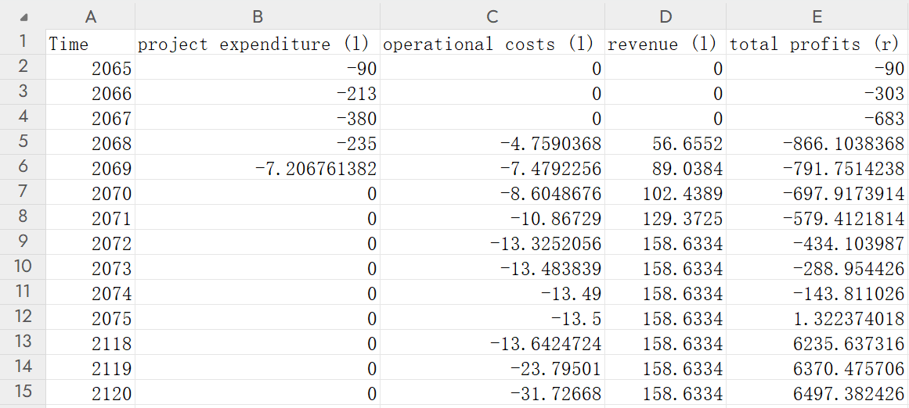

### 现金流量图绘图工具使用说明

**如何下载项目文件到本地？**：点击仓库最上方的绿色Code按钮，点击Download Zip即可下载项目文件的压缩包

该绘图工具项目仓库的目录结构如下：

```bash
CashFlowDiagramDrawer-main/
├── README.md
├── LICENCE
├── CHANGELOG.md
├── cash_flow_diagram.exe
├── cash_flow_diagram.py
├── data.xlsx
├── CashFlowDiagram.png
├── icon.ico
└── md_pic/
    └── ...
```

以下是各文件/文件夹用途：

| 文件/文件夹                     | 用途                                                   |
| ------------------------------ | ------------------------------------------------------ |
| README.md                      | 项目的说明文件                                          |
| LICENCE                        | 项目的开源协议                                          |
| CHANGELOG.md                   | 项目的更新日志                                          |
| cash_flow_diagram.exe          | 绘图工具的可执行文件                                     |
| cash_flow_diagram.py           | 绘图工具的Python源代码                                   |
| data.xlsx                      | 数据文件的模板案例                                       |
| CashFlowDiagram.png            | 绘图工具根据data.xlsx生成的现金流量图                     |
| icon.ico                       | 可执行文件的图标                                         |
| md_pic                         | README.md中的图片源                                     |

以下是绘图工具的使用方法：

1. **提供数据文件**

   在`.xlsx`文件中填入数据（数据一般存放在名为Cash Flow Diagram的Sheet中），具体格式请模仿模板案例。

   

   A列应当**按格式从小到大**填入已提供数据对应的年份，如果中间有一些年份的数据和前后几乎一致，可忽略（如上图中的数据缺少2076-2117年）。在缺失的时间区间内，绘图工具将不会绘制其柱状图部分，而只会将其前一年份和后一年份的折线部分用直线连接。

   除了A列和最后一列，中间所有列应当**按格式**填入柱状图部分数据，如上图中填入了project expenditure、operational costs和revenue（具体含义见iws手册14.9，下同）。

   最后一列（上图中是E列）应当**按格式**填入折线图部分数据，如上图中填入了total profits。

   我们建议，除A列代表时间的数据会作为x轴外，请在其余数据的表头的最后加入其对应y轴方向的提示，如上图中的(l)和(r)。

2. **运行绘图工具程序**

   下面我们给出两种方案来运行绘图工具程序：

   **方案1**：直接运行可执行文件。这需要你严格按照所有要求提供`data.xlsx`数据文件且构建文件目录结构。一种可行的文件目录结构如下：

   ```dash
   Cash Flow Diagram/
   ├── cash_flow_diagram.exe
   └── data.xlsx
   ```

   在这种情况下，数据文件必须命名为`data.xlsx`且与`cash_flow_diagram.exe`处在同一路径下，且绘图数据必须存放在`data.xlsx`中名为`Cash Flow Diagram`的Sheet中。

   在这种情况下，双击`cash_flow_diagram.exe`，会跳出Matplotlib的显示窗口。点击下方Save the figure按钮，即可导出绘制出的现金流量图的`.png`文件。

   **方案2**：对Python源代码文件进行修改后再运行。这需要你拥有合适的Python3环境和相关第三方库。

   | 第三方库     | 下载第三方库的pip指令     | 备注                                     |
   | ------------ | ------------------------- | ---------------------------------------- |
   | `pandas`     | `pip install pandas`      |                                          |
   | `xlrd`       | `pip install xlrd==1.2.0` | 只有2.0以下版本的xlrd才支持读取.xlsx文件 |
   | `matplotlib` | `pip install matplotlib`  |                                          |

   我们可以通过修改源代码内`my_drawer`对象的创建函数的实参来改变数据文件路径、数据所在Sheet。

   如，设定数据文件路径为`'C:/Users/Username/Documents/example.xlsx'`，数据所在Sheet名称为`'example'`，可以修改源代码倒数第2行的代码`my_drawer = Drawer()`为：

   ```python
   my_drawer = Drawer(rd='C:/Users/Username/Documents/example.xlsx',sheet_name='example')
   ```

   如果不修改，默认读取与`cash_flow_diagram.py`在同一路径下的名为`data.xlsx`文件中的名为`Cash Flow Diagram`的Sheet作为绘图数据。

   运行源代码，会跳出Matplotlib的显示窗口。点击下方Save the figure按钮，即可导出绘制出的现金流量图的`.png`文件。

如果使用者想更加深入地研究绘图工具程序的代码逻辑、对程序做进一步的修改以适应自己的绘图需求，Python源代码文件中已经写好了较为详细的注释，请自行阅读。

